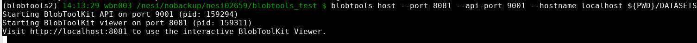

# Launch BlobTools2 viewer via JupyterHub Virtual Desktop

!!! jupyter "1. Install"
    1. Start a Jupyter server session via https://jupyter.nesi.org.nz/. 
        - Ideally with <KBD>4CPUs</KBD> and <KBD>8GB</KBD> of memory 
    
    2. Click  <KBD>Virtual Desktop</KBD> icon
       <center></center>
    
    3. Open a <KBD>Terminal</KBD> session on Virtual Desktop and procees with the installation 
        - Installation can be done via any terminal and not restricted to virtual desktop terminal 

        - change path to nobackup as we are going to create a python virtual environment which will consume a reasonable amount of Inodes.
            ```bash
            cd /nesi/nobackup/nesi12345/
            ```
        - Load a python module
            ```bash
            module purge
            module load Python/3.10.5-gimkl-2022a
            ```
        - Create a virtual environment
            ```python
            python -m venv blobtools2
            ```
        - Activate the environment
            ```bash
            source blobtools2/bin/activate
            ```
        - Install `blobtoolkit[full]`
            ```py
            pip install blobtoolkit[full]
            ```
        - Although installing `[ful]` should take care of the extensions, we recommend installing `[host]` as a standalone command 
            ```py
            pip install blobtoolkit[host]
            ```
!!! jupyter "2. Create a sample dataset and test"

    These instructions are extracted from the [official BlobToolKit support documentation](https://blobtoolkit.genomehubs.org/blobtools2/blobtools2-tutorials/creating-a-dataset/) 

    - Choose a path in *nobackup* as the working directory
    ```bash
    mkdir -p blobtools_tutorial && cd blobtools_tutorial
    ```
    - Download a sample .fast file
    ```bash
    curl ftp://ftp.ncbi.nlm.nih.gov/genomes/all/GCA/001/028/725/GCA_001028725.1_S_venezuelensis_HH1/GCA_001028725.1_S_venezuelensis_HH1_genomic.fna.gz | gunzip -c > ASSEMBLY_NAME.fasta
    ```
    - Create a meta file for viewer 
    ```
    assembly:
      accession: GCA_001028725.1
      alias: S_venezuelensis_HH1
      bioproject: PRJEB530
      biosample: AMD00012916
      record_type: contig
    taxon:
      name: Strongyloides venezuelensis
    ```
    - Create the dataset
    ```bash
    blobtools create --fasta ASSEMBLY_NAME.fasta --meta ASSEMBLY_NAME.yaml --taxid 75913 --taxdump ${PWD}/taxdump ${PWD}/DATASETS/ASSEMBLY_NAME
    ```
!!! jupyter "Launch BlobToolKit viewer"
    - Make sure the working directory contains the **DATASET/** directory and the input files. 
    - Once verify, run 
    ```bash
    blobtools host --port 8081 --api-port 8001 --hostname localhost ${PWD}/DATASETS
    ```
        - If this triggers an error along the lines of `ERROR: Port 8001 already in use, unable to host BlobtoolKit API`...change the port id 
    - If all goes well, it should trigger a message similar to below
    


        